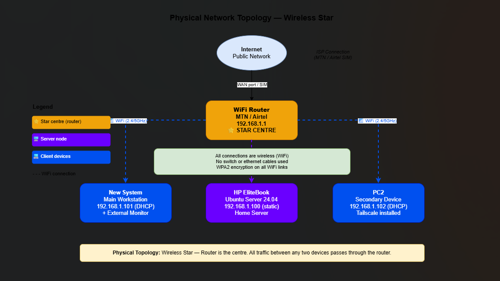
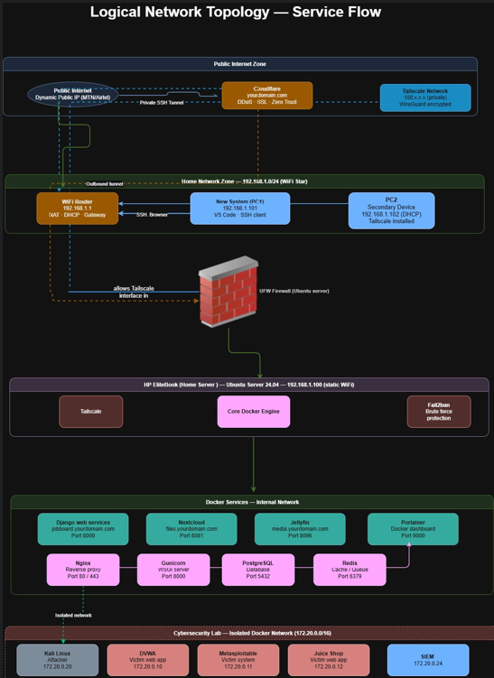

# 02 — Network Topology

## Overview

This document covers the network topology design for the home server lab. Two topology diagrams are used to fully describe the network — a physical topology showing how devices are physically connected, and a logical topology showing how data and traffic flows through the network and its security layers.

---

## Physical Network Topology

### Topology Type
**Wireless Star**

All devices connect wirelessly to a single central point — the WiFi router. No ethernet cables or physical switches are used. Every device communicates through the router, which acts as the star centre.

### Diagram

> 📎 See `physical-topology.png` in this folder

![Physical Network Topology]

### How It Works

```
                        Internet
                            |
                     MTN / Airtel Router
                      YOUR_ROUTER_IP (Star Centre)
                     /          |           \
               WiFi          WiFi           WiFi
                /              |               \
        New System       HP EliteBook          PC2
        YOUR_PC1_IP    YOUR_SERVER_IP       YOUR_PC2_IP
        (DHCP)           (Static)            (DHCP)
        Main Workstation  Home Server        Secondary Device
```

The router is the centre of the star. All traffic between any two devices passes through the router — even traffic between the new system and the EliteBook server passes through the router first before reaching its destination.

### Devices

| Device | Role | IP Address | Connection |
|---|---|---|---|
| MTN / Airtel Router | Star centre · gateway | YOUR_ROUTER_IP | WAN (SIM / ISP) |
| HP EliteBook | Ubuntu Server · home server | YOUR_SERVER_IP | WiFi (static) |
| New System (PC1) | Main workstation | YOUR_PC1_IP | WiFi (DHCP) |
| PC2 | Secondary device | YOUR_PC2_IP | WiFi (DHCP) |

### Key Design Decisions

**No ethernet cables used**
All connections are wireless over 2.4GHz / 5GHz WiFi with WPA2 encryption. This was a deliberate decision based on the physical setup — the EliteBook server sits in a fixed location and connects to the router wirelessly.

**Static IP on the server**
The HP EliteBook is assigned a static local IP of `YOUR_SERVER_IP`. This ensures the server is always reachable at the same address regardless of reboots or router reassignments. All other devices use DHCP and receive dynamic IPs from the router.

**No physical switch**
Since all devices are on WiFi, no switch is needed. The router handles all local network switching and routing between devices on the `YOUR_NETWORK_SUBNET` subnet.

---

## Logical Network Topology

### Topology Type
**Wireless Star — Layered Service Flow**

The logical topology is also a star with the router at the centre. All internet-bound traffic flows through the router as the single gateway. The logical topology additionally shows the security layers, services and traffic flow from the public internet down to the Docker containers running on the server.

### Diagram

> 📎 See `logical-topology.png` in this folder

![Logical Network Topology]

### Traffic Flow — Top to Bottom

```
Public Internet
      ↓
Cloudflare (DDoS · SSL · Zero Trust · hides real IP)
      ↓
MTN Router Firewall — Layer 1
(WPS off · no port forwarding · remote mgmt disabled)
      ↓
UFW Firewall on Ubuntu — Layer 2
(Deny all incoming · allow local YOUR_NETWORK_SUBNET · allow Tailscale)
      ↓
HP EliteBook — Ubuntu Server 24.04 (YOUR_SERVER_IP)
(UFW · Fail2ban · Tailscale · Docker Engine)
      ↓
Portainer — Docker Management Dashboard
(Wraps and manages all containers below)
      ↓
┌─────────────────────────────────────────┐
│           Docker Containers             │
│  Nginx · Gunicorn · PostgreSQL · Redis  │
│  Django Job Board · Nextcloud · Jellyfin│
└─────────────────────────────────────────┘
      ↓ (isolated network)
┌─────────────────────────────────────────┐
│      Cybersecurity Lab (LAB_NETWORK_SUBNET)  │
│  Kali Linux · DVWA · Metasploitable     │
│  Juice Shop · SIEM                      │
└─────────────────────────────────────────┘
```

### Network Zones

#### Zone 1 — Public Internet Zone

| Component | Purpose |
|---|---|
| Public Internet | All external traffic — users, attackers, bots |
| Cloudflare | First line of defence — DDoS protection, SSL termination, Zero Trust access, hides real home IP |
| Tailscale Network | Private WireGuard-encrypted overlay network for SSH access — traffic still passes through ISP and router but is encrypted end to end |

**How Tailscale traffic actually flows:**
```
Work laptop / phone (any network)
      ↓
Tailscale servers (cloud relay if needed)
      ↓
Public Internet → MTN ISP → MTN Router
      ↓
UFW allows Tailscale interface (tailscale0)
      ↓
HP EliteBook (YOUR_TAILSCALE_IP Tailscale IP)
```

Tailscale does not bypass the router. It passes through the router like all other traffic but is WireGuard encrypted so the router cannot read the contents. No port forwarding is needed because the EliteBook initiates the outbound connection to Tailscale on startup — this is called NAT traversal.

#### Zone 2 — Home Network Zone (YOUR_NETWORK_SUBNET)

| Component | IP | Purpose |
|---|---|---|
| WiFi Router | YOUR_ROUTER_IP | NAT · DHCP · default gateway · star centre |
| New System (PC1) | YOUR_PC1_IP | Main workstation · VS Code · SSH client |
| PC2 | YOUR_PC2_IP | Secondary device · Tailscale installed |

Devices on the local network access the server directly via `YOUR_SERVER_IP` — they are not affected by the UFW rules that block public internet traffic. Local network traffic (`YOUR_NETWORK_SUBNET`) is explicitly allowed in UFW.

#### Zone 3 — Firewall Layers

Two independent firewall layers protect the server:

**Layer 1 — MTN Router Firewall**
```
What is blocked / disabled:
✅ WPS disabled
✅ Remote management disabled
✅ No port forwarding rules (Cloudflare Tunnel handles public access)
✅ UPnP disabled

What stays enabled:
✅ DHCP (assigns IPs to devices)
✅ NAT (private IPs share one public IP)
✅ WiFi (WPA2 encrypted)
✅ DNS
```

**Layer 2 — UFW on Ubuntu Server**
```bash
sudo ufw default deny incoming
sudo ufw default allow outgoing
sudo ufw allow from YOUR_NETWORK_SUBNET   # local network always allowed
sudo ufw allow in on tailscale0       # Tailscale SSH
sudo ufw allow 41641/udp              # Tailscale port
sudo ufw enable
```

```
Result:
Local network (192.168.1.x)  → ALLOWED
Tailscale (YOUR_TAILSCALE_IP)        → ALLOWED
Public internet               → BLOCKED
```

#### Zone 4 — HP EliteBook Ubuntu Server

The server runs Ubuntu Server 24.04 with the following installed directly on the OS:

| Component | Type | Purpose |
|---|---|---|
| UFW | OS level | Firewall |
| Fail2ban | OS level | Brute force protection |
| Tailscale | OS level | Private remote access |
| Docker Engine | OS level | Runs all containers |

Everything else runs inside Docker containers — nothing else is installed directly on Ubuntu.

#### Zone 5 — Docker Containers (Portainer wraps all)

Portainer is the Docker management dashboard — it has visibility and control over all containers. In the diagram it wraps all other containers because it manages them.

| Container | Domain / Port | Purpose |
|---|---|---|
| Nginx | Port 80 / 443 | Reverse proxy — routes all incoming traffic |
| Gunicorn | Port 8000 | WSGI server for Django |
| PostgreSQL | Port 5432 | Primary database |
| Redis | Port 6379 | Cache and task queue |
| Django Job Board | jobboard.yourdomain.com | Job board backend API |
| Nextcloud | files.yourdomain.com · Port 8081 | Personal file storage |
| Jellyfin | media.yourdomain.com · Port 8096 | Media streaming |
| Portainer | Port 9000 | Docker management dashboard |

All containers are defined in a single `docker-compose.yml` file. One command starts everything:

```bash
docker compose up -d
```

#### Zone 6 — Cybersecurity Lab (Isolated Docker Network)

The lab runs on a completely isolated Docker network (`LAB_NETWORK_SUBNET`) that has no route to the real server network or the home network. Attacks inside the lab stay inside the lab.

| Container | IP | Role |
|---|---|---|
| Kali Linux | LAB_ATTACKER_IP | Attacker machine |
| DVWA | LAB_VICTIM1_IP | Victim — vulnerable web app |
| Metasploitable | LAB_VICTIM2_IP | Victim — vulnerable Linux system |
| Juice Shop | LAB_VICTIM3_IP | Victim — advanced vulnerable web app |
| SIEM | LAB_SIEM_IP | Security event monitoring |

---

## Key Differences Between Physical and Logical Topology

| | Physical Topology | Logical Topology |
|---|---|---|
| Type | Wireless Star | Wireless Star — layered |
| Centre | WiFi Router | WiFi Router |
| Shows | How devices physically connect | How traffic and data flows |
| Focus | Hardware and connections | Services, security and routing |
| Firewall shown | No | Yes — two layers |
| Docker containers shown | No | Yes — all services |
| Cybersecurity lab shown | No | Yes — isolated network |

---

## Why Both Topologies Are Star

```
Bus topology:
→ All devices share one line
→ All traffic visible to all devices
→ No central controller
→ One device talks, everyone hears

Star topology (this setup):
→ All devices connect to one central point (router)
→ Router controls and directs all traffic
→ Devices only receive traffic meant for them
→ One device talks, router routes to the right destination
```

WiFi shares a radio frequency at the physical transmission level — but at the network layer where topology is defined, the router controls all traffic direction. This makes both the physical and logical topology a star, with the router as the centre in both cases.

---

## Next
→ [02 — Ubuntu Setup](02-ubuntu-setup.md)