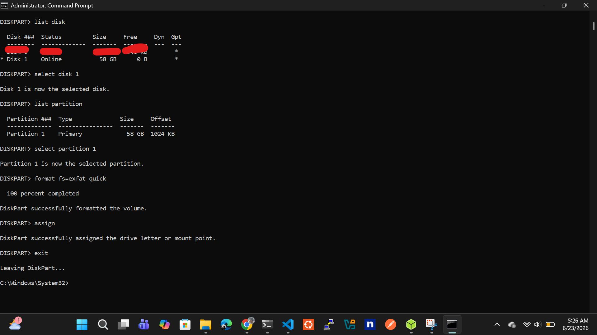
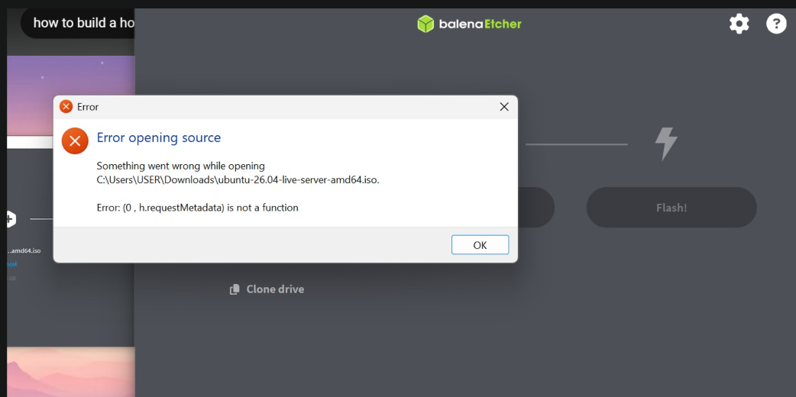

# 01 — Ubuntu Server Installation

## What This Does

This documents the installation of Ubuntu Server on an HP EliteBook laptop,
repurposing it as a dedicated home server. Ubuntu Server is chosen over Ubuntu
Desktop deliberately — it runs no GUI, consuming significantly less RAM and CPU,
leaving maximum resources for the services and apps we will run on it.

> Official Ubuntu download site: https://ubuntu.com/download/server

---

## Why Ubuntu Server and Not Ubuntu Desktop?

| | Ubuntu Desktop | Ubuntu Server |
|---|---|---|
| GUI | Yes | No (terminal only) |
| RAM at idle | ~800MB–1GB | ~200–512MB |
| Purpose | Daily use PC | Servers, headless use |
| Best for this project | ❌ | ✅ |

Since the EliteBook will be accessed remotely via SSH from another machine,
a GUI is unnecessary overhead. Ubuntu Server gives us a clean, lean base.

---

## Prerequisites

Before starting, have the following ready:

- USB drive (minimum 4GB — format it clean before use to avoid corrupted data)
- A second computer to flash the USB and SSH from after setup
- Balena Etcher installed on your second computer → https://balena.io/etcher
- Ubuntu Server 24.04 LTS ISO downloaded → https://ubuntu.com/download/server

> **Always download the LTS (Long Term Support) version.** LTS releases receive
> security updates and support for 5 years, making them the stable and
> reliable choice for a server. At the time of this setup, Ubuntu 24.04 LTS
> is the current stable LTS release.

---

## Step-by-Step Installation

### Step 1 — Prepare the USB Drive

Before flashing, clean the USB drive completely:

**On Windows (via Disk Management):**
1. Press `Win + X` → Disk Management
2. Find your USB drive
3. Right click each partition → Delete Volume
4. Right click unallocated space → New Simple Volume
5. Format as FAT32

**Or via Command Line (diskpart) — recommended:**
```
diskpart
list disk
select disk [your USB disk number — be careful, don't select your main drive]
clean
create partition primary
format fs=fat32 quick
assign
exit
```

---

### Step 2 — Download Ubuntu Server ISO

1. Go to https://ubuntu.com/download/server
2. Click **Download Ubuntu Server 24.04 LTS**
3. Wait for the `.iso` file to fully download before flashing

---

### Step 3 — Flash ISO to USB with Balena Etcher

1. Open Balena Etcher **as Administrator** (right click → Run as administrator)
2. Click **Flash from file** → select your downloaded `.iso`
3. Click **Select target** → select your USB drive
4. Click **Flash** and wait for it to complete and verify
5. When done, ignore any Windows prompts saying the USB is unreadable — this is normal

> ⚠️ **Important:** Always run Balena Etcher as Administrator on Windows.
> Running without admin privileges causes a known bug (see Problems section below).

---

### Step 4 — Boot EliteBook from USB

1. Plug the flashed USB drive into the HP EliteBook
2. Power on the EliteBook
3. Immediately and repeatedly tap `ESC` as it boots — this opens the HP startup menu
4. Press `F9` to open the **Boot Device Options** menu
5. Select your USB drive from the list
6. Press Enter to boot from USB

---

### Step 5 — Install Ubuntu Server

Once booted from USB, the Ubuntu Server installer loads. Follow these screens:

```
Language           → English
Keyboard           → English (US) or your preference
Type of install    → Ubuntu Server (not minimized)
Network            → Configure your WiFi or ethernet here
                     (WiFi: select your network, enter password)
Storage            → Use entire disk (this wipes the EliteBook — intended)
                     ✅ Check "Set up this disk as an LVM group"
Profile setup      → Enter:
                     Your name: [your name]
                     Server name: homeserver
                     Username: [youruser]  ← remember this
                     Password: [strong password] ← remember this
SSH Setup          → ✅ Install OpenSSH server  ← CRITICAL, do not skip
Featured snaps     → Skip all for now
```

> **OpenSSH is critical.** Without it you cannot SSH into the server remotely
> after installation. If you miss this, you will need to reinstall.

---

### Step 6 — Complete Installation

1. Wait for installation to complete — approximately 10–15 minutes
2. When prompted: **Remove the USB drive** and press Enter
3. EliteBook reboots into Ubuntu Server
4. You will see a terminal login prompt — not a desktop, this is correct
5. Log in with the username and password you set during installation

---

### Step 7 — First Commands After Login

```bash

# Check your local IP address (you will need this to SSH from another machine)
ip addr show
# Look for something like 192.168.x.x under your network interface
```

---

### Step 8 — SSH In From Your Main Machine

From your new system (not the EliteBook):

```bash
# SSH into the EliteBook server
ssh youruser@192.168.x.x

# You are now inside the EliteBook remotely
# You no longer need a monitor, keyboard or mouse on the EliteBook
```

From this point forward, all server management is done via SSH from your
main machine. The EliteBook just sits plugged in and running.

---

## Problems I Hit and How I Fixed Them

### Problem 1 — Balena Etcher Error: `(0, h.requestMetadata) is not a function`

**What happened:**
When trying to select the Ubuntu Server ISO in Balena Etcher, this error
appeared immediately and the ISO could not be selected.

**Why it happens:**
This is a known Balena Etcher bug that triggers specifically when selecting
Linux ISO files on Windows when the app is not running with administrator privileges.

**Fix:**
Close Balena Etcher completely. Right click the Balena Etcher icon and select
**Run as administrator.** The error disappears and ISO selection works normally.

---

### Problem 2 — USB Drive Appeared Corrupted After Flashing

**What happened:**
After Balena Etcher finished flashing, Windows showed the USB drive as
unreadable with multiple small unrecognised partitions. Windows prompted
to format the drive. It looked like the USB was damaged.

**Why it happens:**
This is expected behaviour, not actual corruption. Balena Etcher modifies
the USB partition table to create a bootable Linux drive. Windows cannot
read Linux partition formats so it shows them as unreadable. The drive is
perfectly fine.

**Fix:**
After the installation was complete and Ubuntu was installed on the EliteBook,
the USB was restored to normal using diskpart on Windows:

```
diskpart
list disk
select disk [USB disk number]
clean
create partition primary
format fs=fat32 quick
assign
exit
```

This wiped the Linux partitions and restored the USB to a normal Windows-readable
FAT32 drive. The USB is now reusable for anything.

> **Note:** Only do this AFTER Ubuntu is fully installed on the EliteBook.
> Running this during installation will wipe your installer mid-process.

---


## Screenshots

### Balena Etcher Error


### USB Partition Issue in Windows


---

## Result

After completing all steps:

```
✅ Ubuntu Server 24.04 LTS installed on HP EliteBook
✅ OpenSSH running and accessible
✅ Server accessible on local network at 192.168.1.100
✅ SSH login working from main machine (using putty)
✅ USB drive restored and reusable
```


```bash
# Successful SSH connection from main machine
ssh youruser@192.168.1.100

# Output confirms you are inside the server:
Welcome to Ubuntu 24.04 LTS (GNU/Linux 6.8.0-31-generic x86_64)
youruser@homeserver:~$
```

---

## Next Step

→ [02 — Network Setup and Static IP Configuration](02-network-setup.md)
