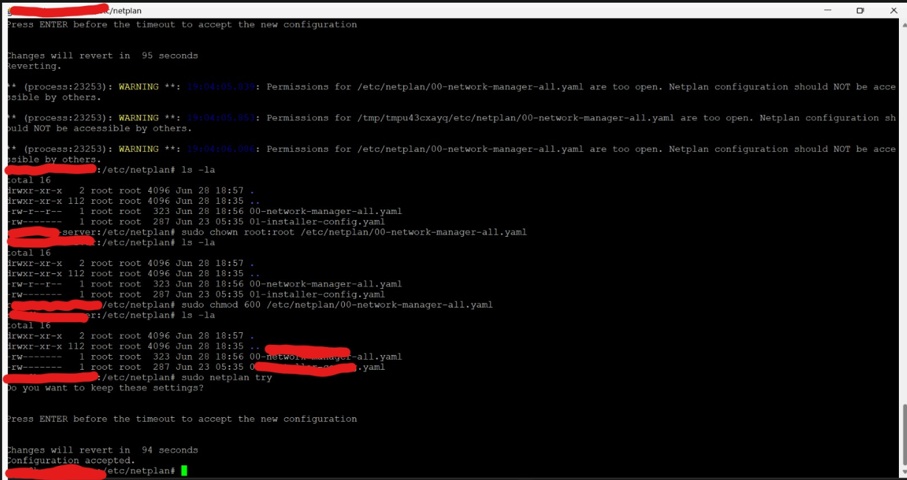

# 03 — Network Setup

## What This Covers

- Cloning the repo and running the setup script on the server
- Setting a static IP address on the HP EliteBook server using Netplan
- Understanding subnetting and how it applies to this setup
- Configuring file permissions on sensitive config files
- Installing Tailscale for private remote access

---

## Step 1 — Clone the Repo and Run Setup Script

After the Ubuntu Server installation was complete and SSH was working, the first thing done was cloning the project repo directly onto the server and running the initialisation script to set up the base environment.

```bash
# SSH into the server from the new system
ssh youruser@YOUR_SERVER_IP

# Clone the repo
git clone https://github.com/yourusername/home-server-lab
cd home-server-lab

# Make the setup script executable
chmod +x scripts/setup.sh

# Run the setup script
./scripts/setup.sh
```

This installs Git, Docker, Docker Compose, UFW, Fail2ban and Tailscale in one go — no manual package installation needed.

---

## Step 2 — Setting a Static IP Address

### Why a Static IP Is Needed

By default the router assigns IPs dynamically via DHCP — meaning the server could get a different IP address every time it reboots. This breaks SSH connections and makes the server unreliable to reach.

Setting a static IP means the server is always at the same address on the local network regardless of reboots or router changes.

### Understanding Subnetting First

Before configuring the static IP, subnetting was revisited to understand what the values in the config actually mean:

```
YOUR_NETWORK_SUBNET

Example breakdown:
192.168.1.100/24

192.168.1.100  →  the IP address of the server
/24            →  subnet mask (255.255.255.0)
               →  means 254 usable host addresses
               →  range: .1 to .254 on this network

Default gateway (router): YOUR_ROUTER_IP
This is the single exit point for all traffic
leaving the local network to the internet
```

Understanding this made it clear what each field in the Netplan config actually represents — not just copying values blindly.

---

### Netplan — What It Is

Netplan is the network configuration tool used in Ubuntu Server. It reads YAML config files and applies them to the system's network interfaces.

Netplan has two backend renderers:

| Renderer | Best for | Why |
|---|---|---|
| `networkd` | Servers (headless) | Lightweight, minimal resources, no GUI needed |
| `NetworkManager` | Desktops and laptops | Advanced features, GUI support, higher resource use |

**`networkd` was chosen** because this is a headless Ubuntu Server — no desktop, no GUI. `networkd` is leaner and more appropriate for server environments.

---

### Finding the WiFi Interface Name

Before writing the config, the correct WiFi interface name on the EliteBook was confirmed:

```bash
ip link show
# Look for the wireless interface — usually wlan0 or wlp2s0
# On this EliteBook it was: wlp2s0
```

---

### Writing the Netplan Config

Instead of modifying the default starter config file provided by Ubuntu, a new YAML file was written from scratch. This was a deliberate learning decision — writing it manually forces understanding of every field rather than editing an existing template.

```bash
# Navigate to netplan directory
cd /etc/netplan/

# List existing config files
ls -la
# Two files exist — netplan applies them in lexicographic order
# A file named 99-custom.yaml will override the default one

# Create a new config file
sudo nano 99-custom.yaml
```

```yaml
network:
  version: 2
  renderer: networkd
  wifis:
    wlp2s0:
      dhcp4: no
      dhcp6: no
      addresses: [YOUR_SERVER_IP/24]
      nameservers:
        addresses: [YOUR_ISP_DNS, 8.8.8.8]
      access-points:
        YOUR_ROUTER_SSID:
          password: YOUR_WIFI_PASSWORD
      routes:
        - to: default
          via: YOUR_ROUTER_IP
```

**What each field means:**

| Field | Value | Purpose |
|---|---|---|
| `renderer` | `networkd` | Lightweight backend for servers |
| `wlp2s0` | WiFi interface name | The wireless interface on this EliteBook |
| `dhcp4: no` | Disabled | We are setting IP manually, not from router |
| `dhcp6: no` | Disabled | No IPv6 needed |
| `addresses` | `YOUR_SERVER_IP/24` | Static IP with subnet mask |
| `nameservers` | ISP DNS + Google DNS | DNS resolution for domain names |
| `access-points` | Router SSID + password | WiFi network to connect to |
| `routes: via` | `YOUR_ROUTER_IP` | Default gateway — all traffic exits here |

> ⚠️ **Security note:** The Netplan config contains sensitive information in plaintext — WiFi SSID name and password. This is why strict file permissions were applied immediately after writing the config.

---

### Securing the Config File

During `sudo netplan try`, a warning appeared about file permissions — the config was readable by multiple users which is a security risk given it contains the WiFi password in plaintext.

This was fixed by locking the file down to root only:

```bash
# Give root ownership of the file
sudo chown root:root /etc/netplan/99-custom.yaml

# Set permissions — only root can read and write
# No access for any other user
sudo chmod 600 /etc/netplan/99-custom.yaml

# Verify permissions
ls -la /etc/netplan/
# Should show: -rw------- root root 99-custom.yaml
```

```
Permission breakdown:
600 = rw-------
r w -   r - -   - - -
owner  group  others
root   none   none

Only root can read or write the file.
All other users have zero access.
```

---

### Testing and Applying the Config

```bash
# Test the config before applying — safe to try
# Reverts automatically after 120 seconds if not confirmed
sudo netplan try

# If no errors — press Enter to confirm and keep changes
# Config is now applied

# Apply permanently
sudo netplan apply

# Verify the static IP is set
ip addr show wlp2s0
```

**Lexicographic override note:**
Two config files exist in `/etc/netplan/`. Netplan applies them in alphabetical order — the file named `99-custom.yaml` is applied last and overrides the default starter config. This was confirmed by reading the Netplan documentation before writing the config.

---

### Verifying After Reboot

To fully confirm the static IP was working, the server was remotely shut down and powered back on:

```bash
# Shut down the server remotely from new system
ssh youruser@YOUR_SERVER_IP "sudo shutdown now"

# Power the server back on physically
# Wait 60 seconds for boot

# SSH back in using the static IP
ssh youruser@YOUR_SERVER_IP

# It worked — server came back at the same IP
```

✅ Static IP confirmed working after full reboot.

---

---

## Step 3 — Installing Tailscale

With the static IP working on the local network, Tailscale was installed next to enable secure remote SSH access from outside the home network — at work, on mobile data, anywhere.

```bash
# Install Tailscale
curl -fsSL https://tailscale.com/install.sh | sh

# Start Tailscale and authenticate
sudo tailscale up --ssh

# A link appears in the terminal — open it in browser
# Log in with your Google account
# Device is now registered on your Tailscale network

# Check Tailscale IP assigned to this server
tailscale ip -4
# Returns something like: YOUR_TAILSCALE_IP
# This IP never changes regardless of which network you are on

# Enable Tailscale to start on boot
sudo systemctl enable tailscaled
```

From any device with Tailscale installed and logged into the same account, SSH into the server using the Tailscale IP:

```bash
ssh youruser@YOUR_TAILSCALE_IP
```

This works from work WiFi, mobile data, a café — any network, anywhere.

---


## Problems Hit

### Problem 1 — Root Privilege Required to Edit Netplan Config

**What happened:**
Tried to edit the Netplan config file without sudo and was denied permission — the file is owned by root.

**Fix:**
Used sudo for all Netplan operations. Created a strong root password first:
```bash
sudo passwd root
```

---

### Problem 2 — Netplan Permission Warning

**What happened:**
Running `sudo netplan try` showed a warning:
```
WARNING: /etc/netplan/99-custom.yaml has too wide permissions
```
The config file was readable by other users — a security risk since it contains the WiFi password in plaintext.

**Fix:**
```bash
sudo chmod 600 /etc/netplan/99-custom.yaml
sudo chown root:root /etc/netplan/99-custom.yaml
```

---

### Problem 3 — Two Config Files Conflicting

**What happened:**
Ubuntu ships with a default Netplan config file. Having two files raised questions about which one would apply.

**Fix:**
Read the Netplan documentation and learned that config files are applied in **lexicographic (alphabetical) order** — the last file wins. Naming the custom file `99-custom.yaml` ensures it is always applied last and overrides the default.

---

## LinkedIn Post

🏠 **Home Server Lab Update: A Simple Installation Turned into a Networking Lesson**

Today, I set out to install Tailscale on my Ubuntu home server so I could securely access it remotely without exposing SSH to the Internet.

The official installation command kept timing out:

```bash
curl -fsSL https://tailscale.com/install.sh | sh
```

Instead of giving up, I treated it like a troubleshooting exercise.

Here's what I investigated:

* Compared MTN and Airtel connectivity
* Changed DNS to Cloudflare and Google
* Verified DNS resolution with `nslookup`
* Used `curl -v` to see exactly where the connection failed
* Ran `tracert` to inspect the network path
* Tested multiple Tailscale endpoints (`tailscale.com`, `login.tailscale.com`, and `pkgs.tailscale.com`)

One interesting discovery was that **only `tailscale.com` was unreachable**, while the login and package repository were accessible. That meant the installer script couldn't be downloaded, but the packages themselves were still available.

I also reached out to **Tosin** to better understand how **BGP (Border Gateway Protocol)** influences Internet routing. It was a great reminder that connectivity issues aren't always DNS or firewall-related—sometimes the path traffic takes across networks is the real problem.

By manually configuring the Tailscale APT repository instead of using the installer script, I successfully installed Tailscale, authenticated my server, and can now securely SSH into it remotely.

Next up:

* 🔐 SSH hardening
* 🔥 Firewall rules and automation scripts
* ☁️ Cloudflare Tunnel integration
* 🐳 Expanding my home server services

Every problem solved is another opportunity to learn.

#HomeLab #Linux #Ubuntu #Networking #CyberSecurity #Tailscale #DevOps #LearningInPublic

---

### Problem 4 — Unable to Install Tailscale Using the Official Installer

**What happened:**

While setting up my Ubuntu home server, I attempted to install Tailscale using the official command:

```bash
curl -fsSL https://tailscale.com/install.sh | sh
````

The installation repeatedly timed out because the installer could not be downloaded from `tailscale.com`.

---

### Investigation

To isolate the problem, I performed the following troubleshooting steps:

* Compared connectivity using MTN and Airtel.
* Changed DNS to Cloudflare (1.1.1.1) and Google (8.8.8.8).
* Verified DNS resolution using `nslookup`.
* Used `curl -v` to determine where the connection failed.
* Ran `tracert` to inspect the network path.
* Tested multiple Tailscale endpoints:

  * `tailscale.com`
  * `login.tailscale.com`
  * `pkgs.tailscale.com`

---

### Findings

| Endpoint            | Result      |
| ------------------- | ----------- |
| tailscale.com       | ❌ Timed out |
| login.tailscale.com | ✅ Reachable |
| pkgs.tailscale.com  | ✅ Reachable |

The issue was isolated to `tailscale.com`. DNS resolution worked correctly, and both the authentication service and package repository were accessible.

---

### Resolution

Since the installer script could not be downloaded, I manually configured the Tailscale APT repository, installed the package using APT, authenticated the server, and verified successful connectivity.

Tailscale is now running successfully on my Ubuntu home server.

---

### Lessons Learned

* DNS resolution does not always mean a service is reachable.
* `curl -v` is an excellent tool for identifying where a connection fails.
* Testing individual service endpoints helps isolate network issues.
* Troubleshooting is about eliminating possibilities with evidence rather than making assumptions.
* Understanding Internet routing concepts such as BGP helps explain why specific services may be unreachable while others work normally.

```

## Result

```
✅ Repo cloned and setup script executed on server
✅ Static IP set and confirmed working after reboot
✅ Netplan config written from scratch (not from template)
✅ Config file secured — root only permissions
✅ Tailscale installed and server accessible remotely
✅ SSH working from new system via local IP
✅ SSH working from outside via Tailscale IP
```

---
## Screenshots


## Next Step

→ [04 — Security Setup — UFW, Fail2ban and SSH Hardening](04-security.md)
